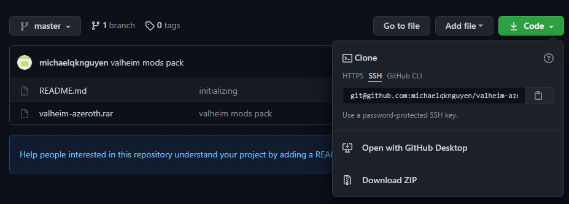
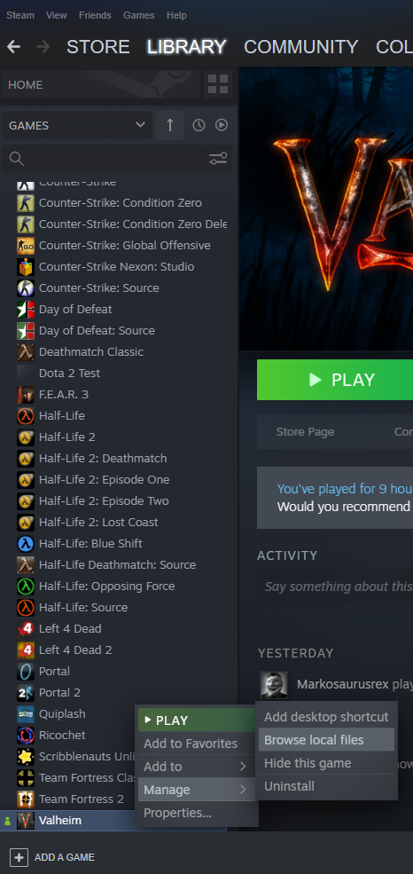

# valheim-azeroth
Mods for Azeroth world in Valheim

The mod pack and the two mods we are using are all packaged in here. All you have to do is copy files over to your game files. Included in the archive file are:

- [BepInExPack](https://valheim.thunderstore.io/package/denikson/BepInExPack_Valheim/)
- [ServerSideMap mod](https://www.nexusmods.com/valheim/mods/88)
- [Clock mod](https://www.nexusmods.com/valheim/mods/85)

## Mod Installation Steps

1. Clone this repo or download ZIP
	
  

2. Extract the contents of `valheim-azeroth.rar`

3. Navigate to your Valheim local files (you can find this from Steam)
	
  

4. Copy all the contents you extracted into this location. Don't copy the valheim-azeroth-content folder itself, but just the files inside over.
